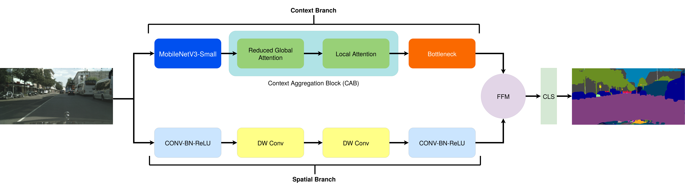
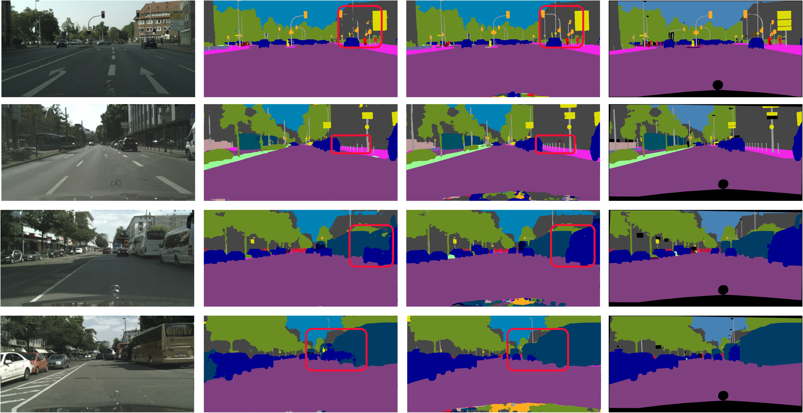
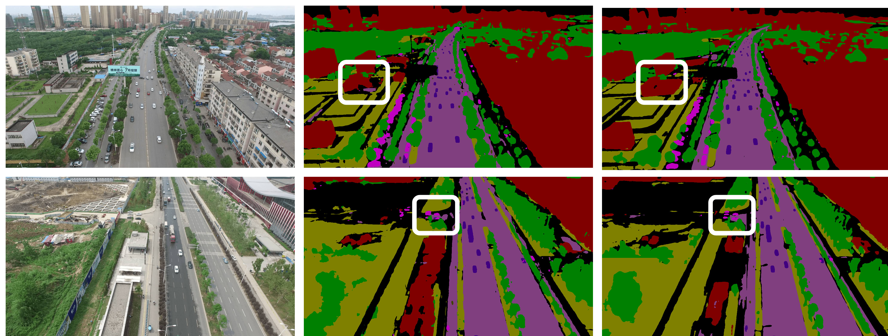

# CABiNet

With the increasing demand of autonomous systems, pixelwise semantic segmentation for visual scene understanding needs to be not only accurate but also efficient for potential real-time applications. In this paper, we propose Context Aggregation Network, a dual branch convolutional neural network, with significantly lower computational costs as compared to the state-of-the-art, while maintaining a competitive prediction accuracy. Building upon the existing dual branch architectures for high-speed semantic segmentation, we design a high resolution branch for effective spatial detailing and a context branch with light-weight versions of global aggregation and local distribution blocks, potent to capture both long-range and local contextual dependencies required for accurate semantic segmentation, with low computational overheads. We evaluate our method on two semantic segmentation datasets, namely Cityscapes dataset and UAVid dataset. For Cityscapes test set, our model achieves state-of-the-art results with mIOU of 75.9%, at 76 FPS on an NVIDIA RTX 2080Ti and 8 FPS on a Jetson Xavier NX. With regards to UAVid dataset, our proposed network achieves mIOU score of 63.5% with high execution speed (15 FPS). 

An overall model architecture of Context Aggregation Network is shown in the figure below. The spatial and context branches allow for multi-scale feature extraction with significantly low computations. Fusion block (FFM) assists in feature normalization and selection for optimal scene segmentation. The bottleneck in the context branch allows for a deep supervision into the representational learning of the attention blocks.



## Results on Cityscapes

Semantic segmentation results on the Cityscapes validation set are shown below. First row consists of the input RGB images; the second row shows the prediction results of SwiftNet (Orsic et al., 2019); the third row shows the predictions from our model and the red boxes show the regions of improvements, and the last row comprises of the ground truth of the input images.




## Results on UAVid

Semantic segmentation results on the UAVid (Lyu et al., 2020) validation set shown below. First row consists of the input RGB images. Second row contains the predictions from our model and the third row shows the ground truth of t.he input images. White boxes highlight the regions. of improvement over the state-of-the-art (Lyu et al., 2020).




# Citation

If you find this work helpful, please consider citing the following articles:

```
@INPROCEEDINGS{9560977,
  author={Kumaar, Saumya and Lyu, Ye and Nex, Francesco and Yang, Michael Ying},
  booktitle={2021 IEEE International Conference on Robotics and Automation (ICRA)}, 
  title={CABiNet: Efficient Context Aggregation Network for Low-Latency Semantic Segmentation}, 
  year={2021},
  pages={13517-13524},
  doi={10.1109/ICRA48506.2021.9560977}}

```
and 
```
@article{YANG2021124,
title = {Real-time Semantic Segmentation with Context Aggregation Network},
journal = {ISPRS Journal of Photogrammetry and Remote Sensing},
volume = {178},
pages = {124-134},
year = {2021},
issn = {0924-2716},
doi = {https://doi.org/10.1016/j.isprsjprs.2021.06.006},
url = {https://www.sciencedirect.com/science/article/pii/S0924271621001647},
author = {Michael Ying Yang and Saumya Kumaar and Ye Lyu and Francesco Nex},
keywords = {Semantic segmentation, Real-time, Convolutional neural network, Context aggregation network}
}
```