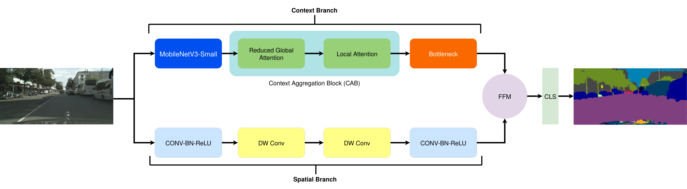
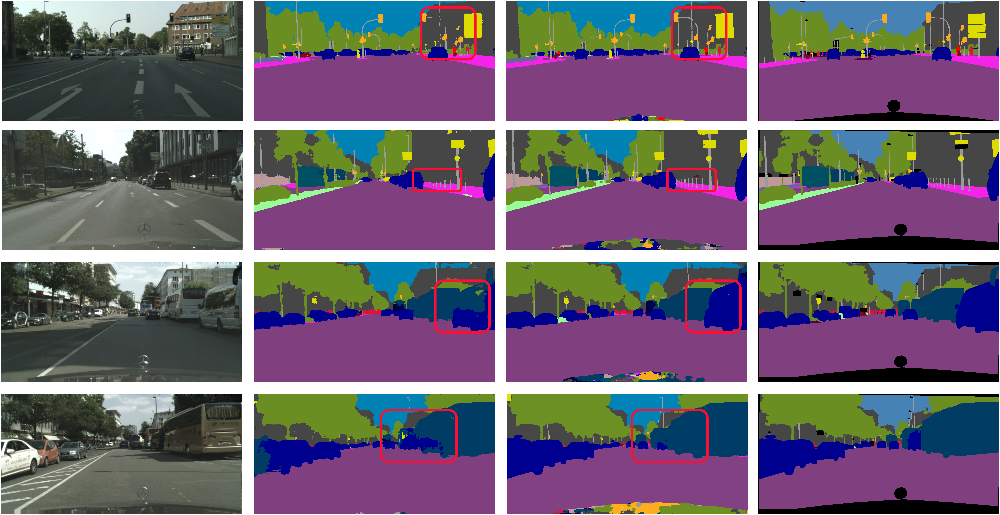
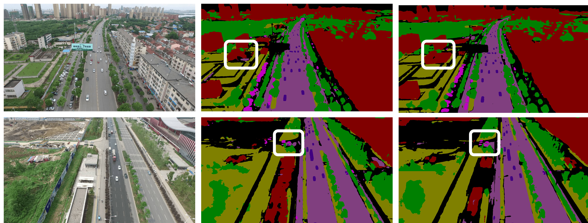

# CABiNet: Efficient Context Aggregation Network for Semantic Segmentation

[](LICENSE)
[](https://www.python.org/downloads/)
[](https://pytorch.org/)

CABiNet (Context Aggregation Network) is a dual-branch convolutional neural network designed for real-time semantic segmentation with significantly lower computational costs compared to state-of-the-art methods while maintaining competitive accuracy. The architecture is specifically optimized for autonomous systems and real-time applications.

## Key Features

- **High Performance**: Achieves 75.9% mIoU on Cityscapes test set at 76 FPS (NVIDIA RTX 2080Ti)
- **Edge Deployment**: 8 FPS on Jetson Xavier NX for embedded applications
- **Dual-Branch Architecture**: Combines high-resolution spatial detailing with efficient context aggregation
- **Lightweight Design**: Reduced computational overhead through optimized global and local context blocks
- **Multi-Scale Support**: Effective feature extraction across different scales

## Performance

### Summary

| Model              | Dataset    | mIoU  | FPS (RTX 2080Ti) | FPS (Jetson Xavier NX) | Params (M) |
| ------------------ | ---------- | ----- | ---------------- | ---------------------- | ---------- |
| **CABiNet (ours)** | Cityscapes | 75.9% | 76               | 8                      | ~3.0       |
| YOLOv8n-seg        | Cityscapes | 68.1% | —                | —                      | 3.4        |
| YOLOv8m-seg        | Cityscapes | 73.5% | —                | —                      | 27.3       |
| YOLOv11n-seg       | Cityscapes | 69.4% | —                | —                      | 2.9        |
| YOLOv11m-seg       | Cityscapes | 74.2% | —                | —                      | 22.4       |
| **CABiNet (ours)** | UAVid      | 63.5% | 15               | —                      | ~3.0       |
| YOLOv8n-seg†       | UAVid      | —     | —                | —                      | 3.4        |
| YOLOv8m-seg†       | UAVid      | —     | —                | —                      | 27.3       |
| YOLOv11n-seg†      | UAVid      | —     | —                | —                      | 2.9        |
| YOLOv11m-seg†      | UAVid      | —     | —                | —                      | 22.4       |

† YOLOSeg UAVid results can be reproduced using the conversion + training workflow described in [UAVid → YOLO Format](#uavid--yolo-format). Entries marked — are pending evaluation runs.

## Architecture

The CABiNet architecture employs a dual-branch design that balances spatial detail preservation and contextual understanding:

- **Spatial Branch**: Maintains high-resolution features for precise boundary detection
- **Context Branch**: Lightweight global aggregation and local distribution blocks for capturing long-range and local dependencies
- **Feature Fusion Module (FFM)**: Normalizes and selects optimal features for scene segmentation
- **Deep Supervision**: Bottleneck in context branch enables better representational learning



## Results

### Cityscapes Dataset

Comparison of semantic segmentation results on the Cityscapes validation set:



_From top to bottom: Input RGB images, SwiftNet predictions, CABiNet predictions (red boxes highlight improvements), ground truth_

### UAVid Dataset

Performance on the UAVid validation set for aerial imagery:



_Columns: Input images, State-of-the-art predictions, CABiNet predictions (white boxes show improvements)_

## Installation

### Prerequisites

- Python 3.8 or higher
- CUDA-capable GPU (recommended)
- Conda or pip for package management

### Quick Setup

1. **Clone the repository**:

   ```bash
   git clone https://github.com/dronefreak/CABiNet.git
   cd CABiNet
   ```

2. **Create and activate environment**:

   ```bash
   # Using conda with provided environment file
   conda env create -f environment.yml
   conda activate cabinet

   # Or install in local environment
   mkdir env/
   conda env create -f environment.yml --prefix env/cabinet
   conda activate env/cabinet
   ```

3. **Install package**:
   ```bash
   pip install -e .
   ```

### Alternative Setup with pip

```bash
python -m venv venv
source venv/bin/activate  # On Windows: venv\Scripts\activate
pip install -e .[dev]
```

## Project Structure

```
CABiNet/
├── src/
│   ├── models/              # Neural network architectures
│   │   ├── cabinet.py       # Main CABiNet model implementation
│   │   ├── cab.py           # Context Aggregation Block (plug-and-play module)
│   │   ├── mobilenetv3.py   # MobileNetV3 backbone implementations
│   │   ├── layers/          # Shared layer components
│   │   └── constants.py     # Model configuration constants
│   ├── datasets/            # Data loading and preprocessing
│   │   ├── cityscapes.py    # Cityscapes dataset loader
│   │   ├── uavid.py         # UAVid dataset loader
│   │   └── transform.py     # Data augmentation pipeline
│   ├── scripts/             # Training and evaluation scripts
│   │   ├── train.py         # Model training
│   │   ├── evaluate.py      # Model evaluation (single/multi-scale)
│   │   └── visualize.py     # Visualization and demo
│   └── utils/               # Utility functions
│       ├── loss.py          # Loss functions (OHEM, Focal Loss)
│       ├── optimizer.py     # Custom optimizer with warmup
│       ├── logger.py        # Logging utilities
│       ├── profiler.py      # Performance profiling tools
│       └── exceptions.py    # Custom exception classes
├── configs/                 # Configuration files
│   ├── train.yaml           # Training configuration (Hydra)
│   ├── dataset/             # Dataset-specific configs
│   │   ├── cityscapes.yaml
│   │   └── uavid.yaml
│   ├── model/               # Model-specific configs
│   │   ├── mobilenetv3_large.yaml
│   │   └── mobilenetv3_small.yaml
│   ├── cityscapes_info.json # Cityscapes label information
│   └── UAVid_info.json      # UAVid label information
├── tests/                   # Test suite
│   ├── unit/                # Unit tests
│   ├── integration/         # Integration tests
│   └── conftest.py          # Shared test fixtures
├── legacy/                  # Legacy configuration files
└── .github/                 # GitHub workflows and documentation
    └── workflows/           # CI/CD pipelines
```

### Key Files and Directories

#### Models ([`src/models/`](src/models/))

- **[`cabinet.py`](src/models/cabinet.py)**: Complete implementation of the CABiNet architecture including spatial branch, context branch, and feature fusion modules
- **[`cab.py`](src/models/cab.py)**: Context Aggregation Block - a modular component that can be integrated into other PyTorch models
- **[`mobilenetv3.py`](src/models/mobilenetv3.py)**: MobileNetV3-Large and MobileNetV3-Small backbone implementations with pretrained weight loading
- **[`layers/common.py`](src/models/layers/common.py)**: Reusable layer components (DepthwiseConv, DepthwiseSeparableConv)

#### Datasets ([`src/datasets/`](src/datasets/))

- **[`cityscapes.py`](src/datasets/cityscapes.py)**: Cityscapes dataset loader with label remapping and thread-safe preprocessing
- **[`uavid.py`](src/datasets/uavid.py)**: UAVid dataset loader with patch-based processing for large aerial images
- **[`transform.py`](src/datasets/transform.py)**: Comprehensive data augmentation including geometric, photometric, and regularization transforms

#### Scripts ([`src/scripts/`](src/scripts/))

- **[`train.py`](src/scripts/train.py)**: Main training script with Hydra configuration, mixed precision training, and evaluation
- **[`evaluate.py`](src/scripts/evaluate.py)**: Multi-scale evaluation with sliding window inference
- **[`visualize.py`](src/scripts/visualize.py)**: Visualization script for generating prediction overlays
- **[`convert_uavid_to_yolo.py`](src/scripts/convert_uavid_to_yolo.py)**: Converts UAVid RGB colour masks → YOLO single-channel format for YOLOSeg benchmarking

#### Utilities ([`src/utils/`](src/utils/))

- **[`loss.py`](src/utils/loss.py)**: OHEM Cross Entropy and Focal Loss implementations
- **[`optimizer.py`](src/utils/optimizer.py)**: Custom optimizer with polynomial learning rate decay and warmup
- **[`profiler.py`](src/utils/profiler.py)**: Performance profiling for inference time, memory usage, and FLOPs analysis

#### Configuration ([`configs/`](configs/))

- **[`train.yaml`](configs/train.yaml)**: Main CABiNet training configuration (Hydra)
- **`dataset/*.yaml`**: Dataset-specific configurations (paths, preprocessing parameters)
  - `cityscapes.yaml` / `uavid.yaml` — CABiNet training configs
  - `uavid_yolo.yaml` — Ultralytics dataset YAML (7 classes, single-channel masks, 255=ignore)
- **`model/*.yaml`**: Model architecture configurations (backbone selection, feature dimensions)
- **`yolo/*.yaml`**: Ultralytics YOLO training/evaluation configs
  - [`uavid_train.yaml`](configs/yolo/uavid_train.yaml) — full training config (AMP, EMA, grad accum, resume, augmentation)
  - [`uavid_val.yaml`](configs/yolo/uavid_val.yaml) — validation / benchmark config

## Usage

### Training

#### Cityscapes Dataset

1. **Download the dataset** from [Cityscapes website](https://www.cityscapes-dataset.com/downloads/):
   - `gtFine_trainvaltest.zip` (241MB) - Ground truth labels
   - `leftImg8bit_trainvaltest.zip` (11GB) - RGB images

2. **Extract and configure**:

   ```bash
   # Extract datasets
   unzip gtFine_trainvaltest.zip -d data/cityscapes/
   unzip leftImg8bit_trainvaltest.zip -d data/cityscapes/

   # Update dataset path in configs/dataset/cityscapes.yaml
   ```

3. **Start training**:
   ```bash
   export CUDA_VISIBLE_DEVICES=0
   python src/scripts/train.py
   ```

#### UAVid Dataset

1. **Download** from [UAVid website](https://uavid.nl/) under Downloads section

2. **Configure and train**:
   ```bash
   # Update dataset path in configs/dataset/uavid.yaml
   python src/scripts/train.py dataset=uavid
   ```

### UAVid → YOLO Format

UAVid distributes ground-truth labels as **3-channel RGB colour-coded masks** (in each sequence's `Labels/` directory). YOLOSeg requires **single-channel PNG masks** where each pixel value is a class index (0 – N-1) and pixels with value `255` are treated as _ignore_.

#### Why the conversion is needed

| Aspect   | UAVid raw (`Labels/`) | YOLO expected format |
| -------- | --------------------- | -------------------- |
| Channels | 3 (RGB)               | 1 (grayscale)        |
| Encoding | RGB colour per class  | Integer class ID     |
| Ignore   | None explicitly       | Pixel value = 255    |

#### Class mapping after conversion

| YOLO ID        | Class      | Original RGB     |
| -------------- | ---------- | ---------------- |
| 0              | Building   | `[128, 0, 0]`    |
| 1              | Road       | `[128, 64, 128]` |
| 2              | Static Car | `[192, 0, 192]`  |
| 3              | Tree       | `[ 0, 128, 0]`   |
| 4              | Vegetation | `[128, 128, 0]`  |
| 5              | Human      | `[ 64, 64, 0]`   |
| 6              | Moving Car | `[ 64, 0, 128]`  |
| 255 _(ignore)_ | Clutter    | `[ 0, 0, 0]`     |

#### Step-by-step workflow

1. **Convert masks** (one-time, ~2 min on 8 CPU cores):

   ```bash
   python src/scripts/convert_uavid_to_yolo.py \
       --src  /data/uavid \
       --dst  /data/uavid_yolo \
       --info configs/UAVid_info.json \
       --split both \
       --workers 8
   ```

   Output layout:

   ```
   /data/uavid_yolo/
   ├── images/
   │   ├── train/   ← symlinks to original RGB PNGs
   │   └── val/
   └── masks/
       ├── train/   ← single-channel class-ID PNGs (255 = ignore)
       └── val/
   ```

2. **Point the dataset YAML** at the converted data:

   ```bash
   export UAVID_YOLO_ROOT=/data/uavid_yolo
   # or edit configs/dataset/uavid_yolo.yaml and set 'path:' directly
   ```

3. **Install Ultralytics**:

   ```bash
   pip install ultralytics
   ```

4. **Train** (uses the pre-configured `configs/yolo/uavid_train.yaml`):

   ```bash
   # Standard run — all important params are set in the config file:
   #   • AMP / mixed precision  (amp=True)
   #   • EMA                    (always on; 'best.pt' = EMA weights)
   #   • Gradient accumulation  (nbs=64 → 64/batch=16 accumulation steps)
   #   • Checkpointing          (save_period=10, best.pt + last.pt)
   #   • Early stopping         (patience=30 epochs)
   #   • Aerial augmentation    (flipud, mosaic, copy_paste tuned for UAVid)
   #   • Class-imbalance        (cls_pw=0.5, inverse-frequency weighting)
   yolo segment train cfg=configs/yolo/uavid_train.yaml

   # Resume an interrupted run (picks up epoch, optimizer, EMA state from last.pt):
   yolo segment train cfg=configs/yolo/uavid_train.yaml resume=True

   # Multi-GPU (DDP) — gradient accumulation and EMA scale automatically:
   yolo segment train cfg=configs/yolo/uavid_train.yaml device=0,1,2,3

   # Swap variant — only override model/name:
   yolo segment train cfg=configs/yolo/uavid_train.yaml \
       model=yolov11m-seg.pt name=yolov11m
   ```

   > **Key parameters explained** (see [`configs/yolo/uavid_train.yaml`](configs/yolo/uavid_train.yaml) for all options with comments):
   >
   > | Parameter            | Value                    | Reason                                                                                |
   > | -------------------- | ------------------------ | ------------------------------------------------------------------------------------- |
   > | `nbs=64`             | grad accum = `nbs/batch` | Effective batch=64; matches CABiNet's `accum_steps=4` with `batch=4` → 16 micro-steps |
   > | `amp=True`           | mixed precision          | ~2× speed-up; YOLO uses `torch.cuda.amp` internally                                   |
   > | `overlap_mask=False` | semantic seg             | Disables instance-mask merging; required for single-channel class-ID masks            |
   > | `resume=True`        | crash recovery           | Restores epoch, optimizer state, EMA state from `last.pt`                             |
   > | `save_period=10`     | extra checkpoints        | Guards against losing more than 10 epochs on crash                                    |
   > | `patience=30`        | early stopping           | Stops if val mIoU doesn't improve for 30 epochs                                       |
   > | `cls_pw=0.5`         | class imbalance          | Upweights rare classes (Human, Moving Car) in loss                                    |
   > | `flipud=0.2`         | augmentation             | Vertical flip valid for top-down UAV view                                             |
   > | `mosaic=0.8`         | augmentation             | Increases small-object diversity (cars, humans)                                       |
   > | EMA                  | always on                | `best.pt` / `last.pt` are EMA-averaged; no separate flag needed                       |

5. **Evaluate**:

   ```bash
   # Single-scale validation (matches 'val' split in uavid_yolo.yaml):
   yolo segment val cfg=configs/yolo/uavid_val.yaml \
       model=runs/uavid/yolov8m/weights/best.pt

   # Test-time augmentation (TTA) — closer to CABiNet multi-scale eval:
   yolo segment val cfg=configs/yolo/uavid_val.yaml \
       model=runs/uavid/yolov8m/weights/best.pt \
       augment=True
   ```

### Evaluation

Evaluate a trained model on the validation set:

```bash
# Single-scale evaluation
python src/scripts/evaluate.py --model-path experiments/model_best.pth

# Multi-scale evaluation (better accuracy, slower)
python src/scripts/evaluate.py --model-path experiments/model_best.pth --multi-scale
```

### Visualization

Generate prediction visualizations:

```bash
python src/scripts/visualize.py
```

### Performance Profiling

Benchmark model performance:

```python
from src.utils.profiler import PerformanceProfiler
from src.models.cabinet import CABiNet

model = CABiNet(n_classes=19, mode="large")
profiler = PerformanceProfiler(model)

# Run comprehensive benchmark
results = profiler.run_full_benchmark(
    input_size=(1, 3, 512, 512),
    num_iterations=100
)

print(f"Average FPS: {results['timing']['fps']:.2f}")
print(f"Peak Memory: {results['memory']['peak_mb']:.2f} MB")
```

## Pretrained Models

Pretrained weights for MobileNetV3 backbones are available in the [`src/models/pretrained_backbones/`](src/models/pretrained_backbones/) directory.

**Note**: Full CABiNet pretrained models on Cityscapes and UAVid will be available soon.

## Testing

Run the test suite to verify installation:

```bash
# Run all tests
pytest tests/

# Run with coverage report
pytest tests/ --cov=src --cov-report=html

# Run specific test category
pytest tests/unit/          # Unit tests only
pytest tests/integration/   # Integration tests only
```

See [`tests/README.md`](tests/README.md) for detailed testing documentation.

## Development

### Code Quality

The project uses several tools to maintain code quality:

- **Black**: Code formatting
- **isort**: Import sorting
- **flake8**: Linting
- **mypy**: Type checking
- **pytest**: Testing framework

### Pre-commit Hooks

Install pre-commit hooks to automatically check code quality:

```bash
pip install pre-commit
pre-commit install

# Run manually on all files
pre-commit run --all-files
```

### Contributing

Contributions are welcome! Please see [`CONTRIBUTING.md`](CONTRIBUTING.md) for guidelines on:

- Setting up the development environment
- Code style and conventions
- Testing requirements
- Pull request process

## Citation

If you find this work helpful, please consider citing our papers:

**ICRA 2021**:

```bibtex
@INPROCEEDINGS{9560977,
  author={Kumaar, Saumya and Lyu, Ye and Nex, Francesco and Yang, Michael Ying},
  booktitle={2021 IEEE International Conference on Robotics and Automation (ICRA)},
  title={CABiNet: Efficient Context Aggregation Network for Low-Latency Semantic Segmentation},
  year={2021},
  pages={13517-13524},
  doi={10.1109/ICRA48506.2021.9560977}
}
```

**ISPRS Journal 2021**:

```bibtex
@article{YANG2021124,
  title = {Real-time Semantic Segmentation with Context Aggregation Network},
  journal = {ISPRS Journal of Photogrammetry and Remote Sensing},
  volume = {178},
  pages = {124-134},
  year = {2021},
  issn = {0924-2716},
  doi = {https://doi.org/10.1016/j.isprsjprs.2021.06.006},
  url = {https://www.sciencedirect.com/science/article/pii/S0924271621001647},
  author = {Michael Ying Yang and Saumya Kumaar and Ye Lyu and Francesco Nex},
  keywords = {Semantic segmentation, Real-time, Convolutional neural network, Context aggregation network}
}
```

## License

This project is licensed under the MIT License - see the [LICENSE](LICENSE) file for details.

## Contact

For questions, issues, or collaboration opportunities:

- **Email**: kumaar324@gmail.com
- **Issues**: Please use the [GitHub issue tracker](https://github.com/dronefreak/CABiNet/issues)
- **Pull Requests**: Contributions are welcome via [pull requests](https://github.com/dronefreak/CABiNet/pulls)

## Acknowledgments

This work was conducted at the University of Twente, Faculty of Geo-Information Science and Earth Observation (ITC).
