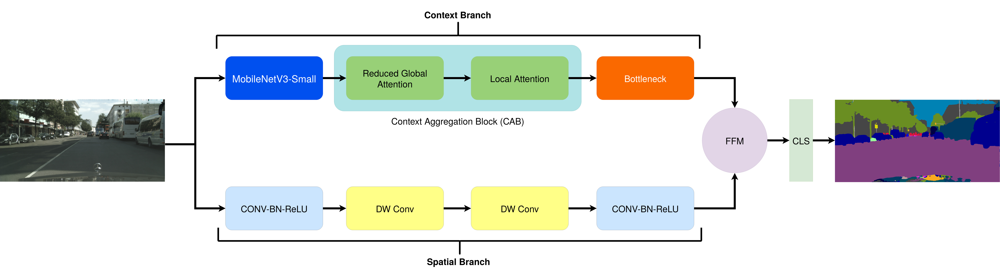
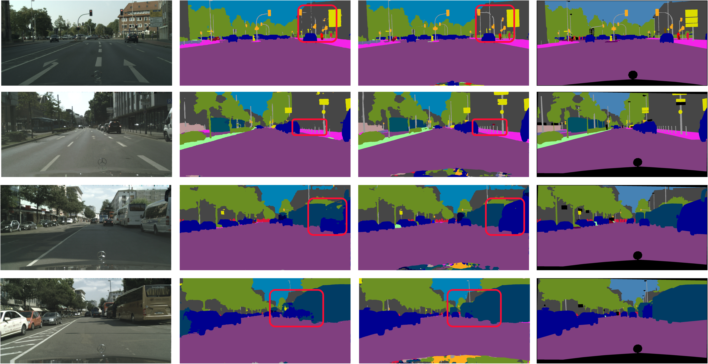
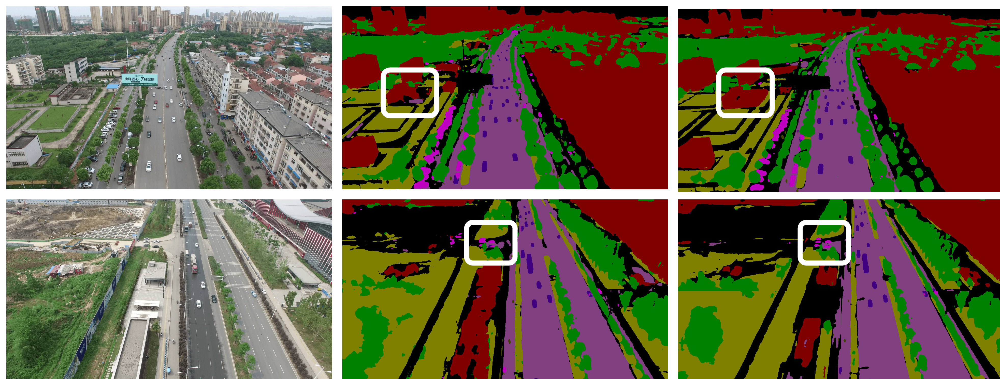

# CABiNet: Efficient Context Aggregation Network for Semantic Segmentation

[](LICENSE)
[](https://www.python.org/downloads/)
[](https://pytorch.org/)
[](https://github.com/dronefreak/CABiNet/actions/workflows/ci.yml)
[](https://github.com/astral-sh/ruff)

[](CONTRIBUTING.md)

CABiNet (Context Aggregation Network) is a dual-branch convolutional neural network designed for real-time semantic segmentation with significantly lower computational costs compared to state-of-the-art methods while maintaining competitive accuracy. The architecture is specifically optimized for autonomous systems and real-time applications.

<p align="center">
  
</p>

## Architecture

The CABiNet architecture employs a dual-branch design that balances spatial detail preservation and contextual understanding:

- **Spatial Branch**: Maintains high-resolution features for precise boundary detection
- **Context Branch**: Lightweight global aggregation and local distribution blocks for capturing long-range and local dependencies
- **Feature Fusion Module (FFM)**: Normalizes and selects optimal features for scene segmentation
- **Deep Supervision**: Bottleneck in context branch enables better representational learning



## Results

### Cityscapes Dataset

Comparison of semantic segmentation results on the Cityscapes validation set:



_From top to bottom: Input RGB images, SwiftNet predictions, CABiNet predictions (red boxes highlight improvements), ground truth_

### UAVid Dataset

Performance on the UAVid validation set for aerial imagery:



_Columns: Input images, State-of-the-art predictions, CABiNet predictions (white boxes show improvements)_

## UAVid Model Zoo

CABiNet and Ultralytics YOLO26 (`semantic` task, dense per-pixel — not `-seg`) are trained and evaluated under one shared UAVid pipeline (`images/`+`masks/` format, 8 classes incl. Clutter).

| Model                       | mIoU (%) | Params (M) | FLOPs (B) | HF Weights                                                                    |
| --------------------------- | -------- | ---------- | --------- | ----------------------------------------------------------------------------- |
| CABiNet (MobileNetV3-Large) | TBD¹     | TBD        | TBD       | [HF Model](https://huggingface.co/dronefreak/cabinet-mobilenetv3-small-uavid) |
| CABiNet (MobileNetV3-Small) | TBD²     | TBD        | TBD       | [HF Model](https://huggingface.co/dronefreak/cabinet-mobilenetv3-large-uavid) |
| YOLO26n-sem                 | 63.58    | TBD        | TBD       | [HF Model](https://huggingface.co/dronefreak/uavid-yolo26n-sem)               |
| YOLO26s-sem                 | 66.88    | TBD        | TBD       | [HF Model](https://huggingface.co/dronefreak/uavid-yolo26s-sem)               |
| YOLO26m-sem                 | 67.66    | TBD        | TBD       | [HF Model](https://huggingface.co/dronefreak/uavid-yolo26m-sem)               |
| YOLO26l-sem                 | 67.20    | TBD        | TBD       | [HF Model](https://huggingface.co/dronefreak/uavid-yolo26l-sem)               |
| YOLO26x-sem                 | TBD³     | TBD        | TBD       | [HF Model](https://huggingface.co/dronefreak/uavid-yolo26x-sem)               |

¹ Trained under the refactored pipeline but not yet re-evaluated. ² Not yet trained. ³ Not yet trained.

## Installation

### Prerequisites

- Python 3.10 or higher
- CUDA-capable GPU (recommended)
- Conda or pip for package management

### Quick Setup

1. **Clone the repository**:

   ```bash
   git clone https://github.com/dronefreak/CABiNet.git
   cd CABiNet
   ```

2. **Create and activate environment**:

   ```bash
   # Using conda with provided environment file
   conda env create -f environment.yml
   conda activate cabinet

   # Or install in local environment
   mkdir env/
   conda env create -f environment.yml --prefix env/cabinet
   conda activate env/cabinet
   ```

3. **Install package**:
   ```bash
   pip install -e .
   ```

### Alternative Setup with pip

```bash
python -m venv venv
source venv/bin/activate  # On Windows: venv\Scripts\activate
pip install -e .[dev]
```

## Project Structure

```
CABiNet/
├── src/
│   ├── models/              # Neural network architectures
│   │   ├── cabinet.py       # Main CABiNet model implementation
│   │   ├── cab.py           # Context Aggregation Block (plug-and-play module)
│   │   ├── mobilenetv3.py   # MobileNetV3 backbone implementations
│   │   ├── layers/          # Shared layer components
│   │   └── constants.py     # Model configuration constants
│   ├── datasets/            # Data loading and preprocessing
│   │   ├── cityscapes.py    # Cityscapes dataset loader
│   │   ├── uavid.py         # UAVid dataset loader
│   │   ├── registry.py      # Shared dataset registry (train.py + evaluate.py)
│   │   └── transform.py     # Data augmentation pipeline
│   ├── scripts/             # Training, evaluation, inference scripts
│   │   ├── train.py                  # CABiNet training
│   │   ├── evaluate.py               # CABiNet standalone checkpoint evaluation
│   │   ├── visualize.py              # Prediction visualization (Cityscapes only)
│   │   ├── train_yolo.py             # YOLO26-sem training/validation (Hydra CLI)
│   │   ├── infer_yolo.py             # YOLO26-sem inference + showcase mosaic
│   │   └── convert_uavid_to_yolo.py  # UAVid RGB masks -> single-channel format
│   └── utils/               # Utility functions
│       ├── loss.py           # OHEM Cross Entropy + Focal Loss
│       ├── optimizer.py      # Custom optimizer with warmup
│       ├── ema.py            # Exponential moving average of model weights
│       ├── early_stopping.py # Patience-based early stopping on mIoU
│       ├── class_weights.py  # Dynamic cls_pw inverse-frequency class weighting
│       ├── logger.py         # Logging utilities
│       ├── profiler.py       # Inference timing / memory profiling
│       └── exceptions.py     # Custom exception classes
├── configs/                 # Configuration files
│   ├── train.yaml           # CABiNet training configuration (Hydra)
│   ├── evaluate.yaml        # Standalone evaluate.py CLI configuration
│   ├── train_yolo.yaml      # YOLO26-sem training configuration (Hydra)
│   ├── dataset/             # Dataset-specific configs
│   │   ├── cityscapes.yaml / uavid.yaml   # CABiNet training configs
│   │   └── uavid_yolo.yaml                # Ultralytics dataset YAML
│   ├── model/               # CABiNet backbone configs (mobilenetv3_{large,small}.yaml)
│   ├── yolo/                # Ultralytics YOLO configs
│   │   ├── uavid_train.yaml / uavid_val.yaml
│   │   └── model/           # Per-variant configs (yolo26{n,s,m,l,x}-sem.yaml, legacy -seg)
│   ├── cityscapes_info.json # Cityscapes label information
│   └── UAVid_info.json      # UAVid label information
├── hf_modelcards/           # Hugging Face model card generator (template + per-model metrics)
├── tests/                   # Test suite
│   ├── unit/                # Unit tests
│   ├── integration/         # Integration tests
│   └── conftest.py          # Shared test fixtures
├── legacy/                  # Legacy configuration files
└── .github/                 # GitHub workflows and documentation
    └── workflows/           # CI/CD pipelines
```

### Key Files and Directories

#### Models ([`src/models/`](src/models/))

- **[`cabinet.py`](src/models/cabinet.py)**: Complete implementation of the CABiNet architecture including spatial branch, context branch, and feature fusion modules
- **[`cab.py`](src/models/cab.py)**: Context Aggregation Block - a modular component that can be integrated into other PyTorch models
- **[`mobilenetv3.py`](src/models/mobilenetv3.py)**: MobileNetV3-Large and MobileNetV3-Small backbone implementations with pretrained weight loading
- **[`layers/common.py`](src/models/layers/common.py)**: Reusable layer components (DepthwiseConv, DepthwiseSeparableConv)

#### Datasets ([`src/datasets/`](src/datasets/))

- **[`cityscapes.py`](src/datasets/cityscapes.py)**: Cityscapes dataset loader with label remapping and thread-safe preprocessing
- **[`uavid.py`](src/datasets/uavid.py)**: UAVid dataset loader — consumes the pre-converted `images/+masks/` format (same as the YOLO pipeline), `RandomCrop`-based training
- **[`transform.py`](src/datasets/transform.py)**: Comprehensive data augmentation including geometric, photometric, and regularization transforms

#### Scripts ([`src/scripts/`](src/scripts/))

- **[`train.py`](src/scripts/train.py)**: CABiNet training — Hydra config, mixed precision, EMA, early stopping, per-epoch mIoU eval
- **[`evaluate.py`](src/scripts/evaluate.py)**: Standalone checkpoint evaluation CLI (Hydra config) — multi-scale, sliding-window inference; also used internally by `train.py`
- **[`visualize.py`](src/scripts/visualize.py)**: Prediction visualization overlays (Cityscapes only)
- **[`train_yolo.py`](src/scripts/train_yolo.py)**: YOLO26 semantic segmentation training/validation (Hydra CLI wrapping Ultralytics)
- **[`infer_yolo.py`](src/scripts/infer_yolo.py)**: YOLO26-sem inference over images/videos/folders, plus a `--showcase-videos` 2x2 mosaic mode
- **[`convert_uavid_to_yolo.py`](src/scripts/convert_uavid_to_yolo.py)**: Converts UAVid RGB colour masks → single-channel class-ID format shared by both pipelines

#### Utilities ([`src/utils/`](src/utils/))

- **[`loss.py`](src/utils/loss.py)**: OHEM Cross Entropy and Focal Loss implementations
- **[`optimizer.py`](src/utils/optimizer.py)**: Custom optimizer with polynomial learning rate decay and warmup
- **[`ema.py`](src/utils/ema.py)**: Exponential moving average of model weights (best/final checkpoints use the EMA model)
- **[`early_stopping.py`](src/utils/early_stopping.py)**: Patience-based early stopping on mIoU
- **[`class_weights.py`](src/utils/class_weights.py)**: Dynamic `cls_pw` inverse-frequency class weighting (ENet formula)
- **[`profiler.py`](src/utils/profiler.py)**: Inference timing and memory profiling (not analytic FLOPs — see [Performance Profiling](#performance-profiling))

#### Configuration ([`configs/`](configs/))

- **[`train.yaml`](configs/train.yaml)**: Main CABiNet training configuration (Hydra)
- **[`evaluate.yaml`](configs/evaluate.yaml)**: Standalone `evaluate.py` CLI configuration
- **`dataset/*.yaml`**: Dataset-specific configurations (paths, preprocessing parameters)
  - `cityscapes.yaml` / `uavid.yaml` — CABiNet training configs
  - `uavid_yolo.yaml` — Ultralytics dataset YAML (8 classes incl. Clutter, single-channel masks, 255=ignore)
- **`model/*.yaml`**: CABiNet backbone configurations
- **`yolo/*.yaml`**: Ultralytics YOLO training/evaluation configs
  - [`uavid_train.yaml`](configs/yolo/uavid_train.yaml) — full training config (AMP, EMA, grad accum, resume, augmentation)
  - [`uavid_val.yaml`](configs/yolo/uavid_val.yaml) — validation / benchmark config
  - `model/yolo26{n,s,m,l,x}-sem.yaml` — per-size model configs, selected via `'yolo/model@model=yolo26s-sem'`

## Usage

### Training

#### Cityscapes Dataset

1. **Download the dataset** from [Cityscapes website](https://www.cityscapes-dataset.com/downloads/):
   - `gtFine_trainvaltest.zip` (241MB) - Ground truth labels
   - `leftImg8bit_trainvaltest.zip` (11GB) - RGB images

2. **Extract and configure**:

   ```bash
   # Extract datasets
   unzip gtFine_trainvaltest.zip -d data/cityscapes/
   unzip leftImg8bit_trainvaltest.zip -d data/cityscapes/

   # Update dataset path in configs/dataset/cityscapes.yaml
   ```

3. **Start training**:
   ```bash
   export CUDA_VISIBLE_DEVICES=0
   python src/scripts/train.py
   ```

#### UAVid Dataset

CABiNet's UAVid training now consumes the same pre-converted `images/+masks/`
dataset format as the [YOLO26 semantic segmentation pipeline](#uavid--yolo-format)
below — one conversion step serves both pipelines, and there's no more raw
RGB-mask parsing at load time.

1. **Download** from [UAVid website](https://uavid.nl/) under Downloads section

2. **Convert** the raw dataset (see [UAVid → YOLO Format](#uavid--yolo-format)
   for full details):

   ```bash
   python src/scripts/convert_uavid_to_yolo.py \
       --src /path/to/raw/uavid --dst /path/to/converted --info configs/UAVid_info.json
   ```

3. **Configure and train**:

   ```bash
   export UAVID_YOLO_ROOT=/path/to/converted
   # or edit configs/dataset/uavid.yaml and set 'dataset_path:' directly
   #
   # UAVid source images are not uniform resolution, and validation applies
   # no crop, so validation_config.batch_size must be 1 (train.py raises a
   # clear error otherwise):
   python src/scripts/train.py dataset=uavid validation_config.batch_size=1
   ```

   > **Breaking change**: `dataset_path` must now point at the _converted_
   > directory (`convert_uavid_to_yolo.py`'s `--dst`), not the raw UAVid
   > distribution — pointing it at raw `uavid_train/` will fail with a
   > missing-directory error.

Key `training_config` knobs (see [`configs/train.yaml`](configs/train.yaml) for full comments):

| Setting                 | Purpose                                                                               |
| ----------------------- | ------------------------------------------------------------------------------------- |
| `cls_pw`                | 0=uniform, 1=full inverse-frequency class weighting (rare classes: Human, Moving Car) |
| `ema_decay` / `ema_tau` | Exponential moving average of weights; best/final checkpoints use the EMA model       |
| `patience`              | Early stopping on mIoU (epochs with no improvement); 0=disabled                       |

`configs/dataset/uavid.yaml`'s `augmentation:` block (degrees, translate, scale, flips, HSV, mixup) mirrors the YOLO26 pipeline's recipe below — see [`transform.py`](src/datasets/transform.py).

### UAVid → YOLO Format

UAVid distributes ground-truth labels as **3-channel RGB colour-coded masks** (in each sequence's `Labels/` directory). YOLO's semantic segmentation task requires **single-channel PNG masks** where each pixel value is a class index (0 – N-1); pixel value `255` is reserved for pixels whose colour doesn't match any known class (corrupted/anti-aliased data) and is excluded from training/eval. Per the original UAVid paper, Clutter is a valid class — it is **not** mapped to the ignore label.

#### Why the conversion is needed

| Aspect   | UAVid raw (`Labels/`) | YOLO expected format |
| -------- | --------------------- | -------------------- |
| Channels | 3 (RGB)               | 1 (grayscale)        |
| Encoding | RGB colour per class  | Integer class ID     |
| Ignore   | None explicitly       | Pixel value = 255    |

#### Class mapping after conversion

All 8 UAVid classes are valid and active — none are mapped to the ignore label (this matches CABiNet's own trainId scheme exactly):

| YOLO ID | Class      | Original RGB     |
| ------- | ---------- | ---------------- |
| 0       | Clutter    | `[ 0, 0, 0]`     |
| 1       | Building   | `[128, 0, 0]`    |
| 2       | Road       | `[128, 64, 128]` |
| 3       | Static Car | `[192, 0, 192]`  |
| 4       | Tree       | `[ 0, 128, 0]`   |
| 5       | Vegetation | `[128, 128, 0]`  |
| 6       | Human      | `[ 64, 64, 0]`   |
| 7       | Moving Car | `[ 64, 0, 128]`  |

`255` is reserved for pixels whose colour doesn't match any of the 8 known classes (corrupted/anti-aliased data) and is excluded from training/eval — it does not apply to any defined class.

#### Step-by-step workflow

1. **Convert masks** (one-time, ~2 min on 8 CPU cores):

   ```bash
   python src/scripts/convert_uavid_to_yolo.py \
       --src  /data/uavid \
       --dst  /data/uavid_yolo \
       --info configs/UAVid_info.json \
       --split both \
       --workers 8
   ```

   Output layout:

   ```
   /data/uavid_yolo/
   ├── images/
   │   ├── train/   ← symlinks to original RGB PNGs
   │   └── val/
   └── masks/
       ├── train/   ← single-channel class-ID PNGs (0-7, all 8 classes valid)
       └── val/
   ```

2. **Point the dataset YAML** at the converted data:

   ```bash
   export UAVID_YOLO_ROOT=/data/uavid_yolo
   # or edit configs/dataset/uavid_yolo.yaml and set 'path:' directly
   ```

3. **Install Ultralytics**:

   ```bash
   pip install ultralytics
   ```

4. **Train** — via the Hydra CLI wrapper, not raw `yolo` commands (the config uses the dense `semantic` task, not `-seg`):

   ```bash
   # Default (yolo26n-sem):
   python src/scripts/train_yolo.py

   # Swap size — only override the model group:
   python src/scripts/train_yolo.py 'yolo/model@model=yolo26s-sem'

   # Override hyperparameters (dotted Hydra overrides):
   python src/scripts/train_yolo.py training_config.epochs=200 training_config.batch_size=8

   # Resume an interrupted run:
   python src/scripts/train_yolo.py training_config.resume=true

   # Multi-GPU (DDP):
   python src/scripts/train_yolo.py runtime.device="0,1"
   ```

   > **Key parameters** (see [`configs/train_yolo.yaml`](configs/train_yolo.yaml) for all options with comments):
   >
   > | Parameter                         | Purpose                                                                     |
   > | --------------------------------- | --------------------------------------------------------------------------- |
   > | `nbs`                             | Gradient accumulation target: `accum_steps = nbs / batch`                   |
   > | `amp`                             | Mixed precision (`torch.cuda.amp`)                                          |
   > | `patience`                        | Early stopping — stops if val mIoU doesn't improve for `patience` epochs    |
   > | `cls_pw`                          | Class-imbalance weighting (upweights rare classes: Human, Moving Car)       |
   > | `flipud`                          | Vertical flip — valid for top-down UAV imagery                              |
   > | `mosaic` / `mixup` / `copy_paste` | Aerial-tuned augmentation for small-object diversity (cars, humans)         |
   > | EMA                               | Always on — `best.pt` / `last.pt` are EMA-averaged; no separate flag needed |

5. **Evaluate**:

   ```bash
   python src/scripts/train_yolo.py mode=val
   python src/scripts/train_yolo.py mode=val validation_config.weights=path/to/best.pt
   ```

6. **Inference & showcase mosaic**:

   ```bash
   # Images/videos/folders -> colorized masks + overlays
   python src/scripts/infer_yolo.py --weights <best.pt> --source <path> --output outputs/inference

   # 2x2 showcase mosaic from 4 clips: each blends raw frame -> full mask
   # over its own duration, tiled into one video
   python src/scripts/infer_yolo.py --weights <best.pt> \
       --showcase-videos clip1.mp4 clip2.mp4 clip3.mp4 clip4.mp4 --output outputs/inference
   ```

### Evaluation

Evaluate a trained checkpoint standalone, independent of a training run (Hydra config: [`configs/evaluate.yaml`](configs/evaluate.yaml)). Accepts either a raw model state_dict (`*_best.pth` / the final saved `.pth`) or a full training checkpoint (`checkpoint_last.pth`):

```bash
# Cityscapes, val split, multi-scale + flip (default)
python src/scripts/evaluate.py checkpoint_path=experiments/.../model_best.pth

# UAVid — validation_config.batch_size=1 is required (source images are not
# uniform resolution); dataset_path comes from configs/dataset/uavid.yaml
python src/scripts/evaluate.py checkpoint_path=... dataset=uavid validation_config.batch_size=1

# UAVid test split
python src/scripts/evaluate.py checkpoint_path=... dataset=uavid validation_config.batch_size=1 split=test

# Fast single-scale evaluation (no flip)
python src/scripts/evaluate.py checkpoint_path=... \
    validation_config.eval_scales=[1.0] validation_config.flip=false
```

`split=train` is intentionally rejected — the dataset classes apply training augmentation whenever `mode='train'`, which would corrupt evaluation metrics. Use `val` or `test`.

### Visualization

Generate prediction visualizations (Cityscapes only — `visualize.py` does not yet use the shared dataset registry, so UAVid is unsupported here):

```bash
python src/scripts/visualize.py
```

### Performance Profiling

Benchmark inference timing and memory usage (`profile_model_flops` currently measures `torch.profiler` CPU/CUDA time, not analytic FLOP counts — real FLOPs for the [UAVid Model Zoo](#uavid-model-zoo) table are still TBD):

```python
from src.utils.profiler import PerformanceProfiler
from src.models.cabinet import CABiNet

model = CABiNet(n_classes=19, mode="large")
profiler = PerformanceProfiler(model)

# Run comprehensive benchmark
results = profiler.run_full_benchmark(
    input_size=(1, 3, 512, 512),
    num_iterations=100
)

print(f"Average FPS: {results['timing']['fps']:.2f}")
print(f"Peak Memory: {results['memory']['peak_mb']:.2f} MB")
```

## Pretrained Models

Pretrained MobileNetV3 backbone weights: [`src/models/pretrained_backbones/`](src/models/pretrained_backbones/).

Full CABiNet + YOLO26-sem checkpoints are being published to a Hugging Face UAVid model zoo — model cards are generated from [`hf_modelcards/`](hf_modelcards/) (one Jinja template + per-model `metrics.json`; run `python hf_modelcards/generate_hf_model_zoo.py` to regenerate all cards). See [UAVid Model Zoo](#uavid-model-zoo) above for current numbers.

## Testing

Run the test suite to verify installation:

```bash
# Run all tests
pytest tests/

# Run with coverage report
pytest tests/ --cov=src --cov-report=html

# Run specific test category
pytest tests/unit/          # Unit tests only
pytest tests/integration/   # Integration tests only
```

See [`tests/README.md`](tests/README.md) for detailed testing documentation.

## Development

### Code Quality

- **Ruff**: Linting and formatting
- **mypy**: Static type checking
- **bandit**: Security linting
- **pytest**: Testing framework

### Pre-commit Hooks

Install pre-commit hooks to automatically check code quality:

```bash
pip install pre-commit
pre-commit install

# Run manually on all files
pre-commit run --all-files
```

### Contributing

Contributions are welcome! Please see [`CONTRIBUTING.md`](CONTRIBUTING.md) for guidelines on:

- Setting up the development environment
- Code style and conventions
- Testing requirements
- Pull request process

## Citation

If you find this work helpful, please consider citing:

```bibtex
@article{LYU2020108,
    author = "Ye Lyu and George Vosselman and Gui-Song Xia and Alper Yilmaz and Michael Ying Yang",
    title = "UAVid: A semantic segmentation dataset for UAV imagery",
    journal = "ISPRS Journal of Photogrammetry and Remote Sensing",
    volume = "165",
    pages = "108 - 119",
    year = "2020",
    issn = "0924-2716",
    doi = "https://doi.org/10.1016/j.isprsjprs.2020.05.009",
    url = "http://www.sciencedirect.com/science/article/pii/S0924271620301295",
}

@INPROCEEDINGS{9560977,
  author={Kumaar, Saumya and Lyu, Ye and Nex, Francesco and Yang, Michael Ying},
  booktitle={2021 IEEE International Conference on Robotics and Automation (ICRA)},
  title={CABiNet: Efficient Context Aggregation Network for Low-Latency Semantic Segmentation},
  year={2021},
  pages={13517-13524},
  doi={10.1109/ICRA48506.2021.9560977}
}

@article{Kumaar_Real-time_Semantic_Segmentation_2021,
  author = {Kumaar, Saumya and Lyu, Ye and Nex, Francesco and Yang, Michael Ying},
  doi = {10.1016/j.isprsjprs.2021.06.006},
  journal = {ISPRS Journal of Photogrammetry and Remote Sensing},
  pages = {124--134},
  title = {{Real-time Semantic Segmentation with Context Aggregation Network}},
  url = {https://www.sciencedirect.com/science/article/pii/S0924271621001647},
  volume = {178},
  year = {2021}
}

@article{jocher2026ultralytics,
  title={Ultralytics YOLO26: Unified Real-Time End-to-End Vision Models},
  author={Jocher, Glenn and Qiu, Jing and Liu, Mengyu and Lyu, Shuai and Akyon, Fatih Cagatay and Kalfaoglu, Muhammet Esat},
  journal={arXiv preprint arXiv:2606.03748},
  year={2026}
}

@software{cabinet_uavid_benchmark,
  author = {Kumaar, Saumya},
  title = {CABiNet: Semantic Segmentation Benchmarking on UAVid (CABiNet vs. YOLO26)},
  url = {https://github.com/dronefreak/CABiNet},
  year = {2026}
}
```

## License

This project is licensed under the Apache License 2.0 - see the [LICENSE](LICENSE) file for details.

## Contact

For questions, issues, or collaboration opportunities:

- **Email**: kumaar324@gmail.com
- **Issues**: Please use the [GitHub issue tracker](https://github.com/dronefreak/CABiNet/issues)
- **Pull Requests**: Contributions are welcome via [pull requests](https://github.com/dronefreak/CABiNet/pulls)

## Acknowledgments

This work was conducted at the University of Twente, Faculty of Geo-Information Science and Earth Observation (ITC).
